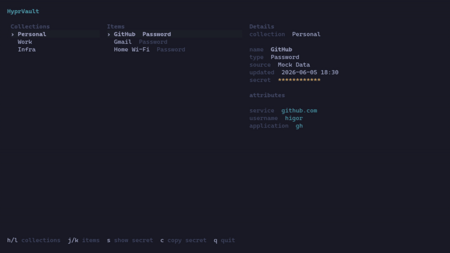

# HyprVault


Terminal-first secret browser for Secret Service on Hyprland and Wayland.

## 💡 Features

- ⚡ Three-pane TUI for collections, items, and details.
- ⚡ Vim-style and arrow-key navigation.
- 📦 Secret Service backend integration.
- 📦 Toggle masked secret previews on demand.
- 📦 Copy secrets to the clipboard with `wl-copy`.
- ⚡ Wrapped details view for narrow terminals.

## 📸 Demo



## 🚀 Quick Start

```bash
git clone <your-repo-url>
cd hyprvault
```

```bash
cargo run
```

## 📦 Installation

```bash
tar -xzf hyprvault_<version>_linux_x86_64.tar.gz
cd hyprvault_<version>_linux_x86_64
sudo install -Dm755 hyprvault /usr/local/bin/hyprvault
hyprvault
```

## ⌨️ Keybindings

| Key | Action |
| --- | --- |
| `h` / `←` | Previous collection |
| `l` / `→` | Next collection |
| `j` / `↓` | Next item |
| `k` / `↑` | Previous item |
| `s` | Toggle secret visibility |
| `c` | Copy selected secret to clipboard |
| `q` | Quit |

## 🗺️ Roadmap

### v0.2.0 (Current)

- [x] Browse non-empty Secret Service collections
- [x] Inspect items in the selected collection
- [x] View item metadata and presentable attributes
- [x] Reveal and hide selected secrets
- [x] Copy secrets with `wl-copy`
- [x] Navigate with vim keys and arrows
- [x] Add Omarchy theme integration

### 🚀 Next Release

- [ ] Add search and filtering for collections and items
- [ ] Show in-app status feedback for copy and load actions
- [ ] Improve secret type detection and labeling
- [ ] Handle empty and error states more gracefully

### 🎨 Future

- [ ] Create, edit, and delete secrets from the TUI
- [ ] Support alternate clipboard backends
- [ ] Add richer sorting and collection management flows

## 🤝 Contributing & License

- Keep PRs focused, small, and tested with `cargo test`.
- Open an issue or draft PR before larger UI or data-model changes.
- Released under the MIT License.
